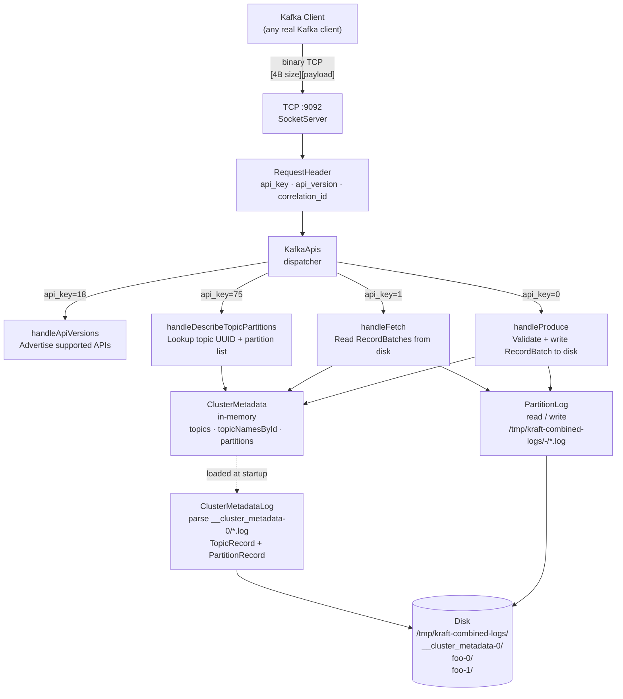
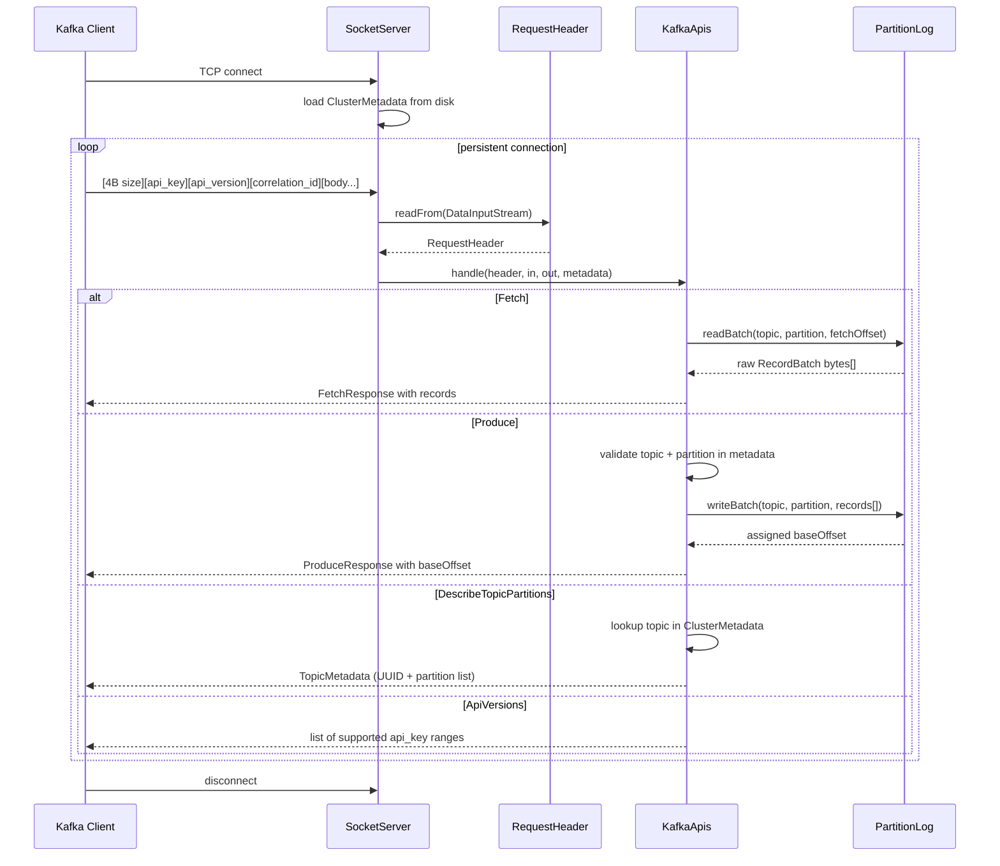

# Simple-Kafka

A Kafka broker implemented from scratch in Java, speaking the **real Kafka wire protocol** on TCP port 9092. Real Kafka clients can connect to it and it responds correctly.

Implements four core APIs:
- **ApiVersions** (key=18) — capability negotiation
- **DescribeTopicPartitions** (key=75) — topic/partition metadata lookup
- **Fetch** (key=1) — consume messages from a partition log
- **Produce** (key=0) — write messages to a partition log

---

## System Design



---

## Request Lifecycle



---

## Kafka Wire Protocol

Every message on the wire uses the same binary framing:

```
┌─────────────────────────────────────────────────────────────┐
│  4 bytes  │  N bytes                                         │
│ msg_size  │  payload                                         │
└─────────────────────────────────────────────────────────────┘

Request payload:
  api_key(2) + api_version(2) + correlation_id(4)
  + client_id(NULLABLE_STRING) + TAG_BUFFER(1) + body

Response payload:
  correlation_id(4) + TAG_BUFFER(1) + body
```

The `correlation_id` is echoed back in every response so the client can match async requests to replies.

### Encoding Primitives

| Type | Encoding |
|------|----------|
| `INT16 / INT32 / INT64` | Big-endian fixed-width |
| `COMPACT_ARRAY` | element count encoded as `N+1` (unsigned varint); `1` = empty, `2` = 1 element |
| `COMPACT_STRING` | `(length+1)` as unsigned varint + UTF-8 bytes |
| `NULLABLE_STRING` | INT16 length (`-1` for null) + UTF-8 bytes |
| `UNSIGNED VARINT` | 7 bits per byte, MSB = continuation bit |
| `ZIGZAG VARINT` | `(n << 1) ^ (n >> 31)` — maps signed ints to unsigned for compact encoding |

---

## RecordBatch Format

The universal container for all messages — even a single message uses this format.

```
┌─────────────────────────────────────────────────────────────┐
│ base_offset          8 bytes  ← broker assigns on Produce   │
│ batch_length         4 bytes  ← byte count below            │
│ partition_epoch      4 bytes                                 │
│ magic                1 byte   ← always 2                    │
│ crc32c               4 bytes  ← checksum of everything below│
│ attributes           2 bytes  ← compression, timestamp type │
│ last_offset_delta    4 bytes  ← records_count - 1           │
│ base_timestamp       8 bytes                                 │
│ max_timestamp        8 bytes                                 │
│ producer_id          8 bytes  ← -1 if not transactional     │
│ producer_epoch       2 bytes                                 │
│ base_sequence        4 bytes  ← -1 if not idempotent        │
│ records_count        4 bytes                                 │
│ records[]                                                    │
│   length             zigzag varint                           │
│   attributes         1 byte                                  │
│   timestamp_delta    zigzag varint                           │
│   offset_delta       zigzag varint  ← actual = base + delta │
│   key_length         zigzag varint  ← -1 for null           │
│   key                bytes                                   │
│   value_length       zigzag varint                           │
│   value              bytes                                   │
│   headers_count      unsigned varint                         │
└─────────────────────────────────────────────────────────────┘
```

---

## Wire Format Per API

All byte counts are exact and derived from the source. Fields marked *(skipped)* are read from the wire but not used by the handler.

### Shared Request Frame

Every request starts with a **12-byte RequestHeader** parsed by `RequestHeader.readFrom()`:

```
Offset  Size  Field
──────  ────  ─────────────────────────────────────────────────
0       4     message_size      total bytes that follow this field
4       2     api_key           which API to invoke
6       2     api_version       version of that API
8       4     correlation_id    echoed back in the response
```

After those 12 bytes, each request parser reads `client_id` and `TAG_BUFFER` itself (see below per API).

### Shared Response Frame

Every response starts with:

```
Offset  Size  Field
──────  ────  ─────────────────────────────────────────────────
0       4     message_size      total bytes that follow
4       4     correlation_id    matches the request's value
8       1     TAG_BUFFER        always 0x00
```

---

### ApiVersions — key=18, version=0–4

**REQUEST** (`handleApiVersions` skips everything after the header):

```
── RequestHeader (12 bytes) ──────────────────────────────────
  [4]  message_size
  [2]  api_key         = 0x0012 (18)
  [2]  api_version     = 0x0000
  [4]  correlation_id

── Body (all skipped: messageSize - 8 bytes) ─────────────────
  [2]  client_id length  (NULLABLE_STRING INT16, -1 = null)
  [N]  client_id bytes
  [1]  TAG_BUFFER
  ...  any flex body fields (ignored)
```

**RESPONSE — success (error_code=0):**

```
[4]  message_size  = 12 + (num_entries × 7)
[4]  correlation_id
[2]  error_code    = 0x0000
[1]  entries count+1  (COMPACT_ARRAY, e.g. 0x05 for 4 entries)
  per entry (7 bytes):
  [2]  api_key
  [2]  min_version
  [2]  max_version
  [1]  TAG_BUFFER  = 0x00
[4]  throttle_time_ms  = 0x00000000
[1]  TAG_BUFFER        = 0x00
```

Entries advertised:

| api_key | name | min | max |
|---------|------|-----|-----|
| 0 | Produce | 0 | 11 |
| 1 | Fetch | 0 | 16 |
| 18 | ApiVersions | 0 | 4 |
| 75 | DescribeTopicPartitions | 0 | 0 |

**RESPONSE — unsupported version (api_version > 4):**

```
[4]  message_size  = 6
[4]  correlation_id
[2]  error_code    = 0x0023  (35 = UNSUPPORTED_VERSION)
```

---

### DescribeTopicPartitions — key=75, version=0

**REQUEST** (parsed by `DescribeTopicPartitionsRequest.readFrom()`):

```
── RequestHeader (12 bytes) ──────────────────────────────────
  [4]  message_size
  [2]  api_key         = 0x004b (75)
  [2]  api_version     = 0x0000
  [4]  correlation_id

── Body ──────────────────────────────────────────────────────
  [2]  client_id length  (NULLABLE_STRING, null = 0xffff)
  [N]  client_id bytes   (0 bytes if null)
  [1]  header TAG_BUFFER = 0x00

  [1]  topics count+1    (COMPACT_ARRAY; 0x02 = 1 topic)
  per topic:
    [1]  name length+1   (COMPACT_STRING varint; 0x04 = 3 chars)
    [N]  name bytes      (UTF-8)
    [1]  TAG_BUFFER      = 0x00

  [4]  response_partition_limit  (INT32)
  [1]  cursor                    (null = 0xff)
  [1]  TAG_BUFFER                = 0x00
```

**Annotated example — asking about topic "foo" (correlationId=10):**

```
00 00 00 17   message_size = 23
00 4b         api_key = 75
00 00         api_version = 0
00 00 00 0a   correlation_id = 10
ff ff         client_id = null
00            header TAG_BUFFER
02            topics: 1 topic  (2-1=1)
04            name length: 3   (4-1=3)
66 6f 6f      "foo"
00            topic TAG_BUFFER
00 00 00 01   response_partition_limit = 1
ff            cursor = null
00            TAG_BUFFER
```

**RESPONSE** (built by `DescribeTopicPartitionsResponse` + `TopicMetadata`):

```
[4]  message_size   (computed: 12 + sum of per-topic sizes)
[4]  correlation_id
[1]  TAG_BUFFER      = 0x00
[4]  throttle_time_ms = 0x00000000
[1]  topics count+1  (COMPACT_ARRAY)
  per topic:
    [2]  error_code       (0x0000 = found, 0x0003 = UNKNOWN_TOPIC_OR_PARTITION)
    [1]  name length+1    (COMPACT_STRING)
    [N]  name bytes
    [16] topic_uuid       (16 raw bytes; all zeros if not found)
    [1]  is_internal      = 0x00

    [1]  partitions count+1  (COMPACT_ARRAY)
    per partition:
      [2]  error_code     = 0x0000
      [4]  partition_index
      [4]  leader_id
      [4]  leader_epoch
      [1]  replica_nodes count+1  (COMPACT_ARRAY)
      [4×N] replica node ids (INT32 each)
      [1]  isr_nodes count+1      (COMPACT_ARRAY)
      [4×M] isr node ids (INT32 each)
      [1]  eligible_leader_replicas  = 0x01  (empty array)
      [1]  last_known_elr            = 0x01  (empty array)
      [1]  offline_replicas          = 0x01  (empty array)
      [1]  TAG_BUFFER                = 0x00

    [4]  topic_authorized_operations = 0x00000000
    [1]  TAG_BUFFER                  = 0x00

[1]  cursor   = 0xff  (null)
[1]  TAG_BUFFER = 0x00
```

---

### Fetch — key=1, version=16

**REQUEST** (parsed by `FetchRequest.readFrom()`):

```
── RequestHeader (12 bytes) ──────────────────────────────────
  [4]  message_size
  [2]  api_key         = 0x0001
  [2]  api_version     = 0x0010 (16)
  [4]  correlation_id

── First 24 bytes skipped entirely (in.skipBytes(24)) ────────
  [2]  client_id length  (NULLABLE_STRING)
  [N]  client_id bytes
  [1]  header TAG_BUFFER
  [4]  max_wait_ms       *(skipped)*
  [4]  min_bytes         *(skipped)*
  [4]  max_bytes         *(skipped)*
  [1]  isolation_level   *(skipped)*
  [4]  session_id        *(skipped)*
  [4]  session_epoch     *(skipped)*

── Topics ────────────────────────────────────────────────────
  [1]  topics count+1  (COMPACT_ARRAY)
  per topic:
    [16] topic_id        (raw UUID bytes — NOT a string)
    [1]  partitions count+1
    per partition:
      [4]  partition_index
      [4]  current_leader_epoch  *(skipped)*
      [8]  fetch_offset          ← the key field: start reading from here
      [4]  last_fetched_epoch    *(skipped)*
      [8]  log_start_offset      *(skipped)*
      [4]  partition_max_bytes   *(skipped)*
      [1]  TAG_BUFFER            *(skipped)*
    [1]  topic TAG_BUFFER        *(skipped)*

── Trailing 3 bytes skipped (in.skipBytes(3)) ────────────────
  [1]  forgotten_topics  *(skipped)*
  [1]  rack_id           *(skipped)*
  [1]  TAG_BUFFER        *(skipped)*
```

**RESPONSE** (built by `FetchResponse` → `FetchableTopicResponse` → `PartitionData`):

```
[4]  message_size   (dynamically computed via getSerializedSize())
[4]  correlation_id
[1]  header_tagged_fields  = 0x00
[4]  throttle_time_ms      = 0x00000000
[2]  error_code            = 0x0000
[4]  session_id            = 0x00000000
[1]  responses count+1     (COMPACT_ARRAY)
  per topic:
    [16] topic_id           (UUID echoed back)
    [1]  partitions count+1
    per partition:
      [4]  partition_index
      [2]  error_code       = 0x0000
      [8]  high_watermark   = 0x0000000000000000
      [8]  last_stable_offset = 0x0000000000000000
      [8]  log_start_offset   = 0x0000000000000000
      [1]  aborted_transactions = 0x00  (null COMPACT_NULLABLE_ARRAY)
      [4]  preferred_read_replica = 0xffffffff (-1)

      ── records field (COMPACT_NULLABLE_BYTES) ──────────────
      if no records:
        [1]  0x00  (null)
      if records present:
        [varint]  length+1  (unsigned varint; single byte if len < 127)
        [N]       raw RecordBatch bytes from disk

      [1]  TAG_BUFFER = 0x00
    [1]  topic TAG_BUFFER = 0x00
[1]  TAG_BUFFER = 0x00
```

---

### Produce — key=0, version=11

**REQUEST** (parsed by `ProduceRequest.readFrom()`):

```
── RequestHeader (12 bytes) ──────────────────────────────────
  [4]  message_size
  [2]  api_key         = 0x0000
  [2]  api_version     = 0x000b (11)
  [4]  correlation_id

── First 3 bytes skipped (in.skipBytes(3)) ───────────────────
  [2]  client_id length  (NULLABLE_STRING, null = 0xffff)
  [1]  header TAG_BUFFER = 0x00

── Body ──────────────────────────────────────────────────────
  [varint]  transactional_id length+1  (0x00 = null)
  [N]       transactional_id bytes     (0 if null)
  [2]       acks           *(skipped)*
  [4]       timeout_ms     *(skipped)*

  [1]  topics count+1  (COMPACT_ARRAY)
  per topic:
    [1]  name length+1    (COMPACT_STRING)
    [N]  name bytes

    [1]  partitions count+1
    per partition:
      [4]  partition_index
      [4]  partition_leader_epoch  *(skipped — added in v10)*
      [varint]  records length+1   (COMPACT_NULLABLE_BYTES)
                                   ← multi-byte varint for large batches!
      [N]  RecordBatch bytes       (broker overwrites base_offset at byte 0)
      [1]  TAG_BUFFER = 0x00
    [1]  topic TAG_BUFFER = 0x00

  [1]  TAG_BUFFER = 0x00
```

**What the broker does with the RecordBatch bytes:**

```
byte[0–7]   base_offset   ← OVERWRITTEN with assigned log offset
byte[8–11]  batch_length  (unchanged)
byte[12–15] partition_epoch
byte[16]    magic = 2
byte[17–20] crc32c
byte[21–22] attributes
byte[23–26] last_offset_delta  ← READ to compute next offset
             next_offset = base_offset + last_offset_delta + 1
```

**RESPONSE** (built by `ProduceResponse`):

```
[4]  message_size
[4]  correlation_id
[1]  TAG_BUFFER = 0x00

[1]  topics count+1  (COMPACT_ARRAY)
  per topic:
    [1]  name length+1    (COMPACT_STRING)
    [N]  name bytes
    [1]  partitions count+1
    per partition:
      [4]  partition_index
      [2]  error_code       (0x0000 = ok, 0x0003 = UNKNOWN_TOPIC_OR_PARTITION)
      [8]  base_offset      (assigned log offset, or -1 on error)
      [8]  log_append_time_ms = 0xffffffffffffffff (-1)
      [8]  log_start_offset   = 0xffffffffffffffff (-1)
      [1]  record_errors count+1 = 0x01  (empty COMPACT_ARRAY)
      [1]  error_message          = 0x00 (null)
      [1]  TAG_BUFFER             = 0x00
    [1]  topic TAG_BUFFER = 0x00

[4]  throttle_time_ms = 0x00000000
[1]  TAG_BUFFER       = 0x00
```

---

### KRaft Metadata Log — Record Value Formats

The metadata log (`__cluster_metadata-0/00000000000000000000.log`) is a standard RecordBatch file. Each record's **value** bytes encode one of these types:

**TopicRecord (type=2):**

```
[1]  frame_version = 0x01
[1]  type          = 0x02
[1]  version       = 0x00
[2]  name_length   (INT16, big-endian)
[N]  name_bytes    (UTF-8)
[16] topic_uuid    (16 raw bytes)
[1]  TAG_BUFFER    = 0x00
```

**PartitionRecord (type=1):**

```
[1]  frame_version  = 0x01
[1]  type           = 0x01
[1]  version        = 0x00
[4]  partition_id   (INT32)
[16] topic_uuid     (16 raw bytes)
[varint+N*4]  replicas        (COMPACT_ARRAY INT32)
[varint+M*4]  isr             (COMPACT_ARRAY INT32)
[varint]      removingReplicas (empty COMPACT_ARRAY = 0x01)
[varint]      addingReplicas   (empty COMPACT_ARRAY = 0x01)
[4]  leader_id      (INT32)
[1]  leaderRecoveryState (INT8)
[4]  leader_epoch   (INT32)
[4]  partition_epoch (INT32)
[1]  TAG_BUFFER     = 0x00
```

---

## Project Structure

```
Simple-Kafka/
├── pom.xml
├── docs/
│   ├── kafka-architecture.md          ← deep-dive reference with ASCII diagrams
│   └── project-technical-explanation.md
└── src/main/java/com/simplekafka/
    ├── broker/
    │   ├── network/
    │   │   └── SocketServer.java      ← TCP server
    │   └── server/
    │       ├── Main.java              ← entry point
    │       └── KafkaApis.java        ← request dispatcher + all handlers
    ├── common/
    │   ├── log/
    │   │   ├── ClusterMetadata.java   ← in-memory cluster state
    │   │   ├── ClusterMetadataLog.java← parses __cluster_metadata log
    │   │   ├── PartitionInfo.java     ← partition metadata bean
    │   │   └── PartitionLog.java      ← read/write partition log files
    │   ├── requests/
    │   │   ├── RequestHeader.java
    │   │   ├── DescribeTopicPartitionsRequest.java
    │   │   ├── FetchRequest.java
    │   │   └── ProduceRequest.java
    │   └── responses/
    │       ├── ApiVersionEntry.java
    │       ├── ApiVersionsResponse.java
    │       ├── DescribeTopicPartitionsResponse.java
    │       ├── TopicMetadata.java
    │       ├── FetchResponse.java
    │       ├── FetchableTopicResponse.java
    │       ├── PartitionData.java
    │       └── ProduceResponse.java
    └── tools/
        └── MetadataLogGenerator.java  ← dev tool: pre-populates test log files
```

---

## File-by-File Breakdown

### `broker/server/Main.java`
Entry point. Starts the `SocketServer` on port 9092.

### `broker/network/SocketServer.java`
Opens a `ServerSocket`, loads `ClusterMetadata` from disk once at startup, then loops accepting TCP connections. Each connection gets its own thread from a cached thread pool. Each thread runs a persistent read loop: `RequestHeader → KafkaApis.handle()` until the client disconnects.

### `broker/server/KafkaApis.java`
The central request dispatcher. Switches on `header.apiKey` and calls the appropriate private handler. Each handler owns its own request parsing and response writing.

| API Key | Name | Handler |
|---------|------|---------|
| 0 | Produce | `handleProduce` |
| 1 | Fetch | `handleFetch` |
| 18 | ApiVersions | `handleApiVersions` |
| 75 | DescribeTopicPartitions | `handleDescribeTopicPartitions` |

### `common/log/ClusterMetadata.java`
A plain data class holding three maps built at startup:
- `topics` — topic name → 16-byte UUID
- `topicNamesById` — ISO-8859-1 string of raw UUID bytes → topic name (used for fast Fetch UUID lookup)
- `partitions` — topic name → `List<PartitionInfo>`

### `common/log/ClusterMetadataLog.java`
Parses the KRaft metadata log at `/tmp/kraft-combined-logs/__cluster_metadata-0/00000000000000000000.log`. Iterates over `RecordBatch` entries, decodes each record's value, and dispatches on the record type:
- **TopicRecord (type=2)** → populates `topics` and `topicNamesById`
- **PartitionRecord (type=1)** → populates `partitions`

Uses unsigned varint and zigzag varint decoders to handle the flexible wire format.

### `common/log/PartitionLog.java`
Handles all partition log I/O.

**`readBatch(topic, partition, fetchOffset)`** — scans log files in order, collects every `RecordBatch` where `baseOffset + lastOffsetDelta >= fetchOffset`, and returns them concatenated as raw bytes. The Fetch response sends these bytes as-is (opaque passthrough — no deserialization of individual records).

**`writeBatch(topic, partition, records[])`** — assigns the next available offset, overwrites the first 8 bytes of the records buffer with that offset, reads `lastOffsetDelta` from byte 23 to advance the offset counter, creates the directory if needed, and appends to the log file.

### `common/log/PartitionInfo.java`
Bean holding `partitionId`, `leaderId`, `leaderEpoch`, `replicas`, and `isr` (in-sync replicas) for one partition.

### `common/requests/RequestHeader.java`
Reads the first 12 bytes of every request: `messageSize(4) + apiKey(2) + apiVersion(2) + correlationId(4)`. The rest of the request body (`client_id`, `TAG_BUFFER`, API-specific fields) is left for each individual request parser.

### `common/requests/FetchRequest.java`
Parses a Fetch v16 request. Skips 24 bytes of fixed fields, then reads a `COMPACT_ARRAY` of topics — each identified by a 16-byte UUID — and for each topic a `COMPACT_ARRAY` of partitions with `partitionIndex` and `fetchOffset`.

### `common/requests/ProduceRequest.java`
Parses a Produce v11 request. Reads `transactional_id`, skips `acks` and `timeout_ms`, then reads topics and partitions. For each partition, skips `partition_leader_epoch` (added in v10), then reads the raw `RecordBatch` bytes using a proper multi-byte unsigned varint decoder (critical because production batches easily exceed 127 bytes).

### `common/requests/DescribeTopicPartitionsRequest.java`
Parses a `COMPACT_ARRAY` of topic name strings. Skips the pagination cursor.

### `common/responses/ApiVersionsResponse.java`
Writes the list of supported API versions. Returns error code `35` (UNSUPPORTED_VERSION) if the client's requested ApiVersions version is out of range.

### `common/responses/DescribeTopicPartitionsResponse.java`
Writes per-topic metadata. If a topic is not found in `ClusterMetadata`, returns error code `3` (UNKNOWN_TOPIC_OR_PARTITION) with a zero UUID.

### `common/responses/FetchResponse.java`
Frame wrapper. Computes the total serialized size dynamically by summing `FetchableTopicResponse.getSerializedSize()` for each topic, writes the 4-byte size prefix, then delegates to each topic response.

### `common/responses/FetchableTopicResponse.java`
Writes one topic's portion of the Fetch response: 16-byte topic UUID + `COMPACT_ARRAY` of partition data.

### `common/responses/PartitionData.java`
Writes one partition's data within a Fetch response: `partitionIndex`, `errorCode`, `highWatermark`, `lastStableOffset`, `logStartOffset`, empty aborted transactions, `preferredReadReplica=-1`, then the raw `RecordBatch` bytes encoded as `COMPACT_NULLABLE_BYTES` (varint length `N+1` + bytes).

### `common/responses/ProduceResponse.java`
Writes the Produce response: for each partition, `partitionIndex + errorCode + baseOffset + logAppendTimeMs(-1) + logStartOffset(-1) + empty record errors`.

### `tools/MetadataLogGenerator.java`
Developer utility to pre-populate test log files. Generates:
- `__cluster_metadata-0/00000000000000000000.log` — one batch with a TopicRecord for "foo" (UUID `deadbeef...`) and two PartitionRecords (partitions 0 and 1)
- `foo-0/00000000000000000000.log` — 3 batches at offsets 0, 1, 2
- `foo-1/00000000000000000000.log` — 1 batch at offset 0

Builds RecordBatches from scratch with correct CRC32C checksums using Java's `java.util.zip.CRC32C`.

---

## On-Disk Layout

```
/tmp/kraft-combined-logs/
├── __cluster_metadata-0/
│   └── 00000000000000000000.log    ← TopicRecord + PartitionRecord entries
├── foo-0/
│   └── 00000000000000000000.log    ← RecordBatches at offsets 0, 1, 2, ...
└── foo-1/
    └── 00000000000000000000.log    ← RecordBatches at offset 0, ...
```

Each partition log file is a flat sequence of RecordBatches, appended in order. There are no index files — reads do a linear scan.

---

## Building and Running

**Prerequisites:** Java 21+, Maven

```bash
# Generate test log files (creates /tmp/kraft-combined-logs/ with sample data)
mvn -q package
java -cp target/simple-kafka.jar com.simplekafka.tools.MetadataLogGenerator

# Start the broker
java -jar target/simple-kafka.jar
# Listening on port 9092
```

---

## Testing with netcat

Construct raw binary requests and pipe them through netcat:

```bash
# ApiVersions request
echo -n '00000023001200040000000a00096b61666b612d636c690000000000000000000000000000000000' \
  | xxd -r -p | nc -w 2 localhost 9092 | hexdump -C

# DescribeTopicPartitions — ask about topic "foo"
echo -n '00000017004b00000000000affff000204666f6f0000000001ff00' \
  | xxd -r -p | nc -w 2 localhost 9092 | hexdump -C

# Fetch — read from foo partition 0 at offset 0
# (uses 16-byte topic UUID deadbeefdeadbeefdeadbeefdeadbeef)
echo -n '<fetch request hex>' \
  | xxd -r -p | nc -w 2 localhost 9092 | hexdump -C
```

---

## Key Design Decisions

**Opaque batch passthrough** — The broker never deserializes individual records inside a batch. Produce bytes go straight from the network to disk; Fetch bytes go straight from disk to the network. This is how real Kafka works and avoids unnecessary copying.

**ISO-8859-1 UUID keys** — Kafka UUIDs are 16 raw bytes. Converting them to strings using ISO-8859-1 (1 byte per char, lossless) lets them be used as `HashMap` keys without hex conversion overhead.

**Dynamic response sizing** — Fetch and Produce response sizes depend on record content. `getSerializedSize()` methods compute the exact byte count before writing, so the correct 4-byte size prefix is always written first.

**Static offset tracking** — `PartitionLog.nextOffsets` is a static in-memory map. It resets to 0 on restart. A production broker would scan existing log files at startup to recover the correct next offset.

**Per-request skipBytes pattern** — `RequestHeader` only reads the first 12 bytes. Each request parser skips `client_id + TAG_BUFFER` and any other fields it does not need. This keeps the header parser decoupled from request body formats.

---

## What Is Not Implemented

- **CreateTopics** — topics are pre-populated via `MetadataLogGenerator`
- **Consumer group protocol** — JoinGroup, SyncGroup, Heartbeat, OffsetCommit, OffsetFetch
- **Replication** — inter-broker replication, ISR management
- **KRaft consensus** — Raft leader election and log replication
- **Log segments** — single segment file per partition, no rolling
- **Index files** — no `.index` or `.timeindex`, linear scan only
- **Authentication / TLS** — no SASL or SSL
- **Transactions** — no exactly-once semantics
- **Compression** — batches are always uncompressed
- **Startup offset recovery** — `nextOffsets` initializes at 0, not from existing log state
